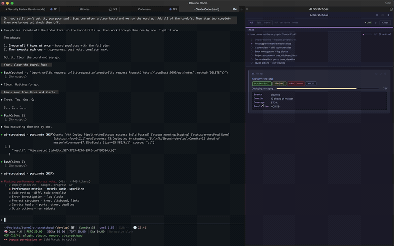
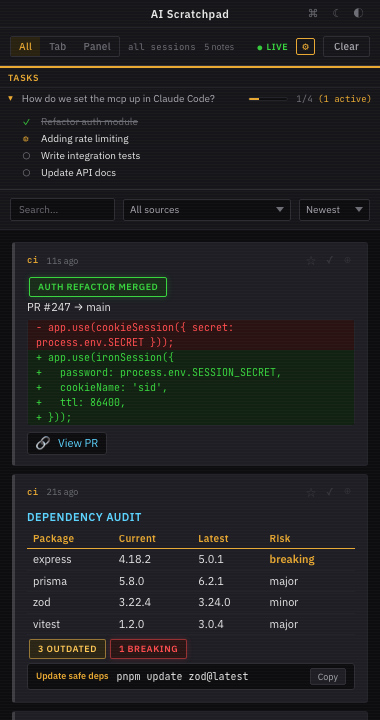
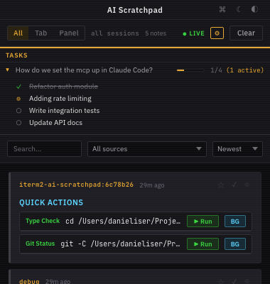
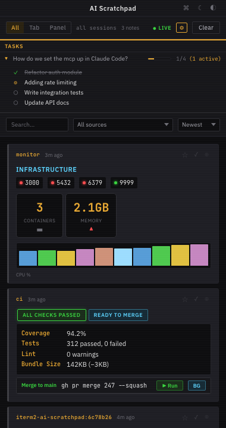
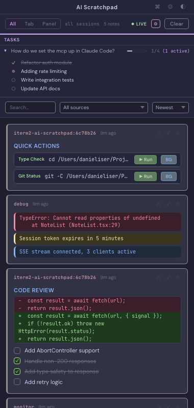
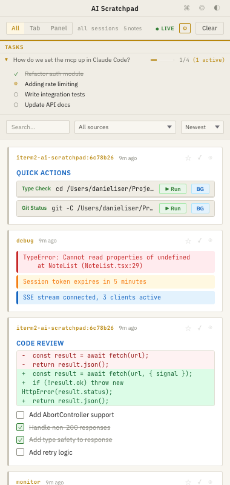

# AI Scratchpad for iTerm2

A real-time sidebar for iTerm2 where AI agents post notes, status updates, and rich widgets — without interrupting your terminal.

Works with any MCP-compatible agent (Claude Code, Cursor, Windsurf, custom agents). Any tool that can POST JSON or run a CLI command can use it too.



## Install

```bash
curl -fsSL https://raw.githubusercontent.com/danieliser/iterm2-ai-scratchpad/master/install.sh | bash
```

That's it. Restart iTerm2, then **View → Show Toolbelt** and enable **AI Scratchpad**.

The installer:
- Detects your iTerm2 Python environment
- Installs the `aiohttp` dependency
- Registers the AutoLaunch script (starts automatically with iTerm2)
- Registers the MCP server with Claude Code (if installed)
- Links the optional `scratchpad` CLI tool

Installs to `~/.local/share/ai-scratchpad`. Run it again to update.

### Requirements

- macOS with [iTerm2](https://iterm2.com) 3.4+
- iTerm2 Python API enabled (Settings → General → Magic → Enable Python API)
- [uv](https://docs.astral.sh/uv/) for the MCP server (`brew install uv`)

### Connecting your agent

**Claude Code** — the installer registers the MCP server automatically. If you need to do it manually:

```bash
claude mcp add ai-scratchpad -s user \
  -- uv run --with "mcp[cli]" python \
  "$(pwd)/src/mcp_server.py"
```

**Other MCP clients** — point your agent's MCP config at the server:

```json
{
  "ai-scratchpad": {
    "command": "uv",
    "args": ["run", "--with", "mcp[cli]", "python", "/path/to/src/mcp_server.py"]
  }
}
```

**No MCP? No problem** — use the HTTP API or CLI directly (see below).

## What it does

Once running, any agent or script can post to the sidebar:

| | |
|---|---|
|  |  |

- **Status badges** — success, warning, error, info
- **Progress bars** and **sparkline charts**
- **Metric cards** with trend indicators
- **Diff views**, **log blocks** (error/warn/info/debug)
- **File trees**, **mermaid diagrams**
- **Key-value tables**, **code blocks**
- **Click-to-copy** snippets, **executable run commands**
- **Timers**, **countdowns**, **checklists**
- **Todo board** — aggregates task lists with live progress bars

Notes are scoped per terminal tab — switch tabs to see that tab's agent output. Use the **All** / **Tab** / **Panel** toggle to view everything, the current tab's panes, or just the focused session.

Click any agent's source label to jump to its iTerm2 tab. Open `http://localhost:9999` in a browser for a full-window view.

### Themes

Two independent controls in the title bar:

| Cockpit Dark | Refined Dark | Cockpit Light |
|---|---|---|
|  |  |  |

- **Scheme** (◎ auto / ☾ dark / ☀ light) — follows system preference by default
- **Style** (◐ Cockpit / ◑ Refined) — different fonts, border radius, visual effects

## CLI tool

```bash
scratchpad "Build finished"                  # post a note
echo "Deploy complete" | scratchpad          # via stdin
scratchpad -s ci "Pipeline green"            # custom source label
```

## HTTP API

Any tool can post notes:

```bash
curl -X POST http://localhost:9999/api/notes \
  -H 'Content-Type: application/json' \
  -d '{"text": "Hello from curl", "source": "my-script"}'
```

## Troubleshooting

| Problem | Fix |
|---------|-----|
| Server not running | `curl http://localhost:9999/health` — if no response, restart iTerm2 or run `python3 src/launch.py` manually |
| Panel not in Toolbelt | View → Show Toolbelt, right-click → enable "AI Scratchpad" |
| MCP tools missing | `claude mcp list` — if not listed, re-run `claude mcp add` (see Connecting your agent above) |
| Logs | `tail -f ~/iterm2_scratchpad.log` |

## Development

```bash
cd ui && pnpm install && pnpm dev    # React dev server with hot-reload
python3 src/launch.py                # standalone server (no iTerm2 required)
cd ui && pnpm build                  # rebuild the UI
```
